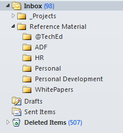
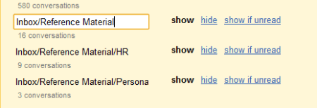
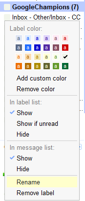
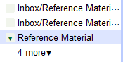
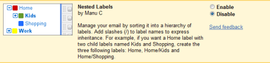
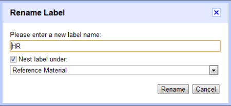
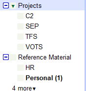

Today my organisation started the move from Microsoft Exchange Server to Google Mail and as part of the move I have been nominated what they are referring to as a Google Champion. This is effectively an early adopter from each department which essentially means to help iron out any issues during the transition and to help flesh out FAQs and training material that might be useful for the rest of the organisation.

Having used Microsoft Outlook as my primary email client for well over 10 years I thought it might be useful to share my experiences with moving to Gmail. As part of the early adoption phase, I wanted to try and exclusively use the web client and make the most of the features they have made available rather than continuing to use Outlook and using the available sync tools.

Something many of us use in Outlook is folders, but Gmail doesn’t use folders, instead it uses labels. Therefore when my Exchange mailbox was converted, the folders actually get converted as filters with the emails within those folders also tagged with the relevant label. As you can see on the image on the right, the folder structure is a hierarchy, however the labels in Google Mail are simply a text label, therefore the representation of the tree structure gets converted to my folder structure include all folders will be converted as **Level1/Level2/Level3** or given my folder structure **Inbox/Reference Material/Personal**.

I wanted to clean up the structure by simply renaming them back to a single level structure. This can be done under **Settings** –&gt; **Labels** as shown below:

I simply renamed the **Inbox/Reference Material** to **Reference Material**.

When renaming the label, all emails also get their labels updated. You can also rename labels from the main page as follows:

After I started doing this, I discovered one of the greatest strengths of using the web client as opposed to a desktop client is the use of Labs. Under **Settings** –&gt; **Labs** is a treasure trove of add ins for Gmail which provide a heap of extra functionality, and the gem I used in this instance was called Nested Labels. Enabling this add in as the name suggests gives us a hierarchy for labels which means I can keep the folder structure I had in Outlook.

Enabling the add in:

Renaming labels now allows for providing a hierarchy:

View of labels in the desired hierarchy:

