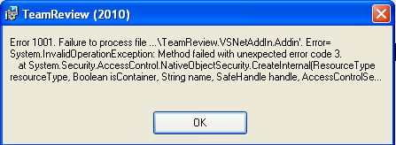

During the installation of Team Review 2010 you may encounter the following error:

To resolve this you need to make sure you have the Visual Studio add-in folder for the current user:

- %APPDATA%\Microsoft\MSEnvShared\AddIns

Depending on the operating system you are installing this on, the folder will be either:

- **Windows XP**: "C:\Documents and Settings\&lt;username&gt;\Application Data\Microsoft\MSEnvShared\AddIns"
- **Windows 7**: “C:\Users\&lt;username&gt;\AppData\Roaming\Microsoft\MSEnvShared\Addins”

If the required folder does not exist, simply manually create it and re-run the installation.

This problem relates to Release 1.1.2 and the issue has been raised on CodePlex.
