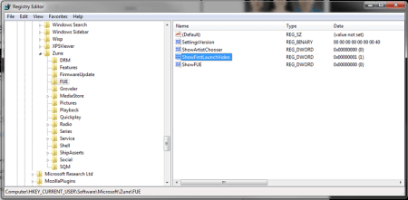

I downloaded the latest version of the Zune software on my home PC and was very impressed by the start-up video, however on my work pc I upgraded from a previous version and upon start-up the video was missing. I found that you can re-enable this through a simply registry edit. Open Regedit and navigate to **HKCU\Software\Microsoft\Zune\FUE**. Find a key called **ShowFirstLaunchVideo** and set its value to 1.

Next time you launch Zune you will be presented with the start-up video.

